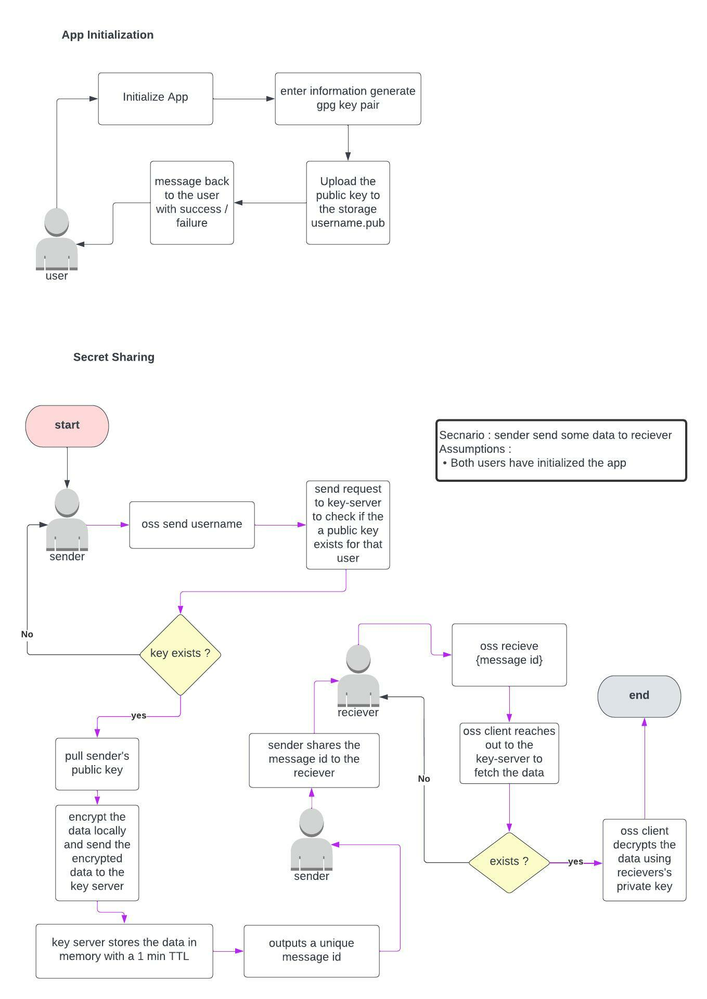

# Open Secret Share 

- Self hosted secret sharing with gpg

### How it works

## Self Hosting

### key-server 

- This is a grpc server that will interface with the storage provider and the oss clients. This also will maintain the temporary in memory cache of the messages.

- Configurations
    - To use the existing Google Cloud Storage storage provider, create a service account in your google cloud account with proper permissions to view, create objects in a storage bucket
    - When the service account is generated, base64 encode it and set the `GOOGLE_CREDENTIALS` environment variable. Make sure to disale wrap when you encode to base64 `ie: base64 -w 0 service_account.json > service_account_encoded.txt` 
    - Create a GCS Bucket
    - Set the `GOOGLE_STORAGE_BUCKET` environment variable with the name of the bucket.
    - [Generate / create a random string](https://generate-random.org/api-key-generator) to be used as a api key to communicate between clients and key-server.
    - Set the `AUTH_KEY` environment variable with the random string that was generated 
    - If no `PORT` variable was set the server will start on port `50051`

- Build and the server
    - with docker 
        - `make docker`
    - without docker 
        - `make go`

### oss 
- Configurations
    - Set the `SERVER` environment variable with the key-server url
    - Set the `AUTH_KEY` environment variable with the same string that was generated when setting up the api

- Build and run the server 
    - `go build -o oss .` or run `make`
    -  to run the client `./oss` 

### Adding a new storage provider 

- Create the storage provider in the `key-server/storageproviders` directory that satistifes the [StorageProvider](https://github.com/Niraj-Fonseka/open-secret-share/blob/main/key-server/storageproviders/storage.go#L3) interface
- Initialize and add your storage provider when server is created https://github.com/Niraj-Fonseka/open-secret-share/blob/main/key-server/server.go#L109

